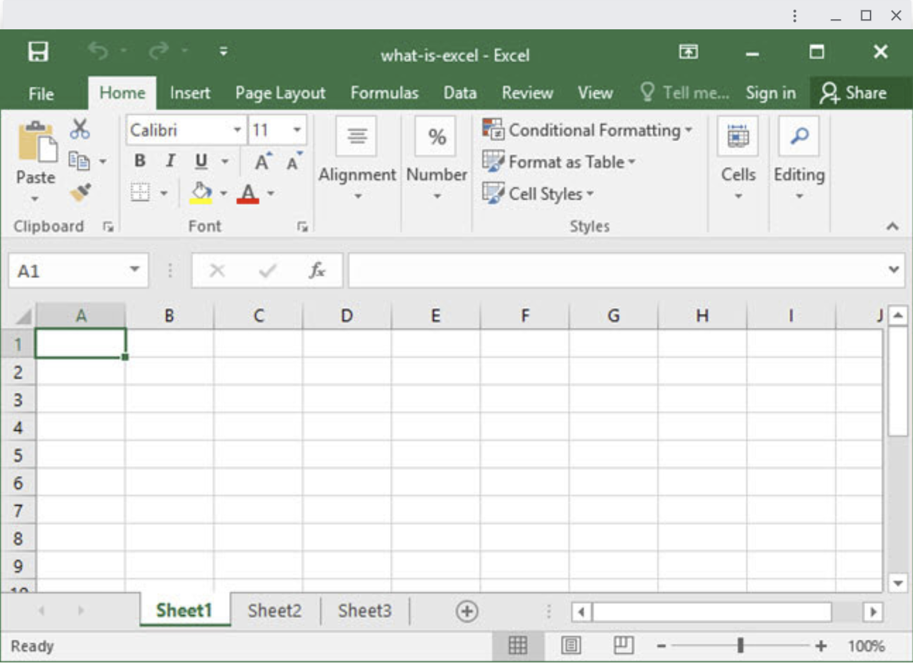

# Additional Windowing Controls Explainer

Authors: [isandrk@chromium.org](mailto:isandrk@chromium.org), [msw@chromium.org](mailto:msw@chromium.org)

Reviewers: [domenic@chromium.org](mailto:domenic@chromium.org)

Last updated: Sep 05, 2023

## Introduction

This proposal introduces additional ways for web applications to introspect and control their windows, to enable critical window management functionality on the web platform.

The proposed enhancement would allow web applications to maximize, minimize, and restore their windows and introspect that window display state. Further, it allows applications to be notified when the window is repositioned, and control whether the window can be resized.

The [window management permission](https://w3c.github.io/window-management/#api-permissions) will be required for the new JS APIs (window.maximize()/minimize()/restore()/setResizable(bool)).
The new CSS media features `display-state` and `resizable` are not gated behind a permission as they can follow the non-AWC API toggled states as well. Also window.onmove event won't be gated behind any permission and unlike other APIs, it will be available to normal browser window too (not just web apps).


## Background

[Virtual Desktop Infrastructure](https://en.wikipedia.org/wiki/Desktop_virtualization) (VDI) providers allow software running remotely on a host device to be displayed on a separate client device. For example, the VDI provider's cloud might run a text processor application, and present the user interface window within a client device’s desktop environment, as if that application were running locally.

[Additional Explorations](https://github.com/w3c/window-management/blob/main/additional_explorations.md#extend-apis-to-control-window-state-display-modes-etc) of [Window Management](https://github.com/w3c/window-management) contained suggestions for incremental improvements to existing window management APIs. That helped inform this explainer, and contains more background.

[Window Controls Overlay](https://wicg.github.io/window-controls-overlay/) offers new capabilities for web applications to control the area that would generally be occupied by the title bar in an installed web application running on a desktop environment. That specification also allows applications to [define draggable regions or content](https://wicg.github.io/window-controls-overlay/#defining-draggable-sections), which is highly relevant to this proposal.

Demo glitch app that ties in proposals from this doc https://seamless-titlebar-example.glitch.me/


## Problem and Use Cases

VDI web clients have limited abilities to integrate remote application windows with the local desktop environment, which creates suboptimal experiences for their users. Currently, they can only present full disjoint remote desktop environments (e.g. in a local fullscreen window), or present individual remote applications in separate local windows with titlebar window controls that are inoperative, redundant, and confusing for users.


<p align="center"><sub>Remote window presented within a local window</sub></p>


Several VDI clients, including Citrix and VMWare, have reported that their users strongly desire an integrated experience as their work is increasingly happening both on local client and remote host devices.

Unfortunately, the web platform offers no means for web applications to signal the user agent when users interact with remote application (or custom) window controls. Further, web applications cannot introspect the local window’s display state, and must poll for local window position changes. These platform gaps create disconnects between local and remote windows, and prevent web VDI clients from offering functionality expected by users.

These missing capabilities also prevent a broader set of web applications from offering compelling window management experiences for their users.


## Proposal

This proposal seeks to enable local web applications to convey a user's intended window control interactions with remote (or custom) window controls. Summary of the API proposals, which are generally gated by Window Management permission:


*   `await window.minimize()/maximize()/restore()` changes the window display state
*   `display-state` CSS media feature yields the current window display state
*   `window.onmove` event is fired when the window moves
*   `await window.setResizable(bool)` sets whether the window is user-resizable
*   `resizable` CSS media feature yields whether the window is user-resizable

Use cases explored here also rely upon a [parallel effort to standardize](https://github.com/w3c/csswg-drafts/issues/7017) the existing CSS property `-webkit-app-region/app-region`.


### Support custom and remote titlebar window dragging

An [open proposal to standardize](https://github.com/w3c/csswg-drafts/issues/7017) the existing `-webkit-app-region/app-region `CSS property is valuable for [Window Controls Overlay](https://wicg.github.io/window-controls-overlay/) and for VDI client use cases explored here. This property allows web apps to specify web content areas (e.g. custom or remote application title bars) that can be used to drag the window within the local desktop environment. (ref. [Electron seamless titlebar tutorial](https://github.com/binaryfunt/electron-seamless-titlebar-tutorial)):


```html
<body>
  <header id="titlebar">
    <div id="drag-region"></div>
  </header>
  ...
</body>

#titlebar #drag-region {
  app-region: drag; /* The magic happens here. */
}
```


### Obviate the need for polling window positions

A new `move` event on `window` fires when the window’s position changes, in a pattern similar to the existing window <code>[resize](https://w3c.github.io/csswg-drafts/cssom-view-1/#resizing-viewports)</code> event, if the site has permission. When a user-agent determines that the window’s top left corner at coordinates (x, y) has moved (e.g. as a result of the user repositioning the browser window), run these steps:


1. If the site doesn’t have the Window Management permission, abort these steps.
2. Update the `window.screenX` and `window.screenY` properties with the new coordinates.
3. Fire an event named `move` at the `window` object.

`Move` events will not be fired at background pages - when the page regains focus a single coalesced event will be fired (similar to how the `resize` event works). This is to prevent cross-site tracking amongst tabs in the same window.

See related specification material for [moveTo](https://w3c.github.io/csswg-drafts/cssom-view-1/#dom-window-moveto), [resizeTo](https://w3c.github.io/csswg-drafts/cssom-view-1/#dom-window-resizeto) & [resize](https://w3c.github.io/csswg-drafts/cssom-view-1/#resizing-viewports).


```js
window.addEventListener('move', () =>
  console.log('New window position: ${window.screenX}, ${window.screenY}'));
```


This obviates the need for polling if a web application wants to save a user’s window placement and restore that on their next session, or change the relative placement of remote windows in response to changes of their local counterparts.

That second use case is particularly important if VDI implementations use a single composited framebuffer to capture remote application window content from a composited view of the remote desktop. In that case, local and remote window placements must be synchronized, so that remote window occlusions (their overlaps) correspond with their local counterparts.


### Support custom and remote window display state controls

In order to provide web applications the ability to integrate a remote application’s window controls with the local window manager, we propose adding new `window.minimize()/maximize()/restore()` async APIs.

In addition the app needs to be able to 1) query the current window display state (`window.displayState` property), and 2) receive window display state change events (new `displaystatechange` event which fires when the window display state changes). This is so that the app can eg. toggle maximize/restore buttons.

Code example of manually rolling the buttons (ref. [Electron seamless titlebar tutorial](https://github.com/binaryfunt/electron-seamless-titlebar-tutorial)):


```html
<header id="titlebar">
  <div id="drag-region">
    <div id="window-controls">
      <div id="minimize-button"></div>
      <div id="maximize-button"></div>
      <div id="restore-button"></div>
      <div id="close-button"></div>
    </div>
  </div>
</header>
```


```css
#window-controls {
  /* We can't click on draggable regions for the window, make buttons
     non-draggable. */
  app-region: no-drag;
}

/* Toggle maximize/restore buttons. */

/* Hide restore button by default, show only in maximized state. */
#restore-button {
  display: none !important;
}

/* Handle maximized state. */
@media (display-state: maximized) {
  #titlebar {
    width: 100%;
    padding: 0;
  }
  #window-title {
    margin-left: 12px;
  }
  #restore-button {
    display: flex !important;
  }
  #maximize-button {
    display: none;
  }
}
```


```js
/* Handle buttons. */

document.getElementById('minimize-button').addEventListener('click', event => {
  await window.minimize();
});

document.getElementById('maximize-button').addEventListener('click', event => {
  await window.maximize();
});

document.getElementById('restore-button').addEventListener('click', event => {
  await window.restore();
});

document.getElementById('close-button').addEventListener('click', event => {
  window.close();
});
```

```js
/* Query the window display-state in JS. */
window.matchMedia("(display-state: maximized)").matches;
```


In addition VDI apps may request that the client window be made resizable or not, to match the behavior of the remote window, for that we would also add `window.setResizable(bool)` async API function and we would get the value with a `resizable` CSS media feature.


```css
/* Handle resizable styles. */
@media (resizable: true) {
  #class-name {
    /*styles to be applied*/
  }
}
```


```js
// Make the window size fixed.
try {
  await window.setResizable(false);
} catch (error) {
  console.log('Setting a fixed size window failed: ', error);
}
```


New `window.minimize()/maximize()/restore()` async APIs ask the user agent to perform the operation on the provided window object. They return a Promise which is resolved once the operation has succeeded, or is rejected if there was an error (lack of necessary permission for the API).


*   If a properly-permissioned request matches the target state, it should just succeed idempotently (eg. maximize() when the window is already maximized). If the requested state cannot be achieved, the promise should be rejected (eg. maximize() a window that is closed, tabbed, cross-origin, on another virtual desktop/workspace, blocked by a modal dialog, etc.).
*   `minimize()/maximize()/restore()` operations follow platform convention.
*   [Snapped states](https://support.microsoft.com/en-us/windows/snap-your-windows-885a9b1e-a983-a3b1-16cd-c531795e6241) aren’t typically exposed to nor initiated by client applications on desktop platforms, and each platform does them a little differently. They are out of scope here.

A new `display-state` CSS media feature indicates the current display state of the window. Possible values are `normal/minimized/maximized/fullscreen`. The property will always contain the value `normal` if there was an error (e.g. a lack of permission).

A new `window.setResizable(bool)` async API asks the user agent to set whether users can resize the provided window object. It returns a Promise which is successfully resolved, or is rejected if there was an error (lack of permission). This allows VDI client applications to request that local windows match the behavior of the remote window.

This API requests that the user agent prevent resize drag handles on top-level windows, and it has no effect on iframe windows. Maximize is prevented, but minimize and restore still work as expected. Not all resizes can be prevented (e.g. window being moved to another display with a size smaller than the window) and it’s ultimately the client app's responsibility to handle such cases.
While user-initiated attempts to enter fullscreen are prevented, applications can still utilize the [Fullscreen API](https://developer.mozilla.org/en-US/docs/Web/API/Fullscreen_API) (i.e. `Element.requestFullscreen()`)  to request fullscreen programmatically. To prevent script-initiated fullscreen requests, developers can override `Element.prototype.requestFullscreen`, set an [HTTP `fullscreen` permission-policy](https://developer.mozilla.org/en-US/docs/Web/HTTP/Headers/Permissions-Policy/fullscreen) or use the [FullscreenAllowed](https://chromeenterprise.google/policies/#FullscreenAllowed) enterprise policy for managed sessions.

A new `resizable` CSS media feature indicates whether the provided window object is user resizable.


## Alternatives considered


### How do we want to set window display states?


*   `window.minimize()/maximize()/restore()` async functions that return promises for async permission checks/prompts and for async window manager ops
    *   PROs:
        *   functions perform well-understood actions
        *   similar to how `play()` and `pause()` work on media elements (even though there’s a `.paused` getter), or `show()` and `close()` on dialogs
    *   CONs:
        *   need multiple functions compared to `setWindowState` option
*   `window.setDisplayState(state)` async function (& similar `window.setResizable(bool)` to set whether users can resize the window)
    *   PROs:
        *   compared to `updateParams` simpler and better defined 
    *   CONs:
        *   less intuitive than the `minimize/maximize/restore` option
*   `window.updateParams({param: value, …})` async function
    *   PROs:
        *   one function that could accommodate both setting the window `displayState` & `resizable`
        *   future extensible
    *   CONs:
        *   design too generic
        *   doubtful that all future "params" (whatever those are) will have the same shape
        *   type system will already fight back if we try to have one that is a string (`displayState`) and one that is a boolean (`resizable`)


### How do we want to retrieve information?


* `display-state` (& `resizable`) CSS media feature
    * PROs:
        * Precedent of [display-mode](https://developer.mozilla.org/en-US/docs/Web/CSS/@media/display-mode)
        * Allows for UI changes to be specified strictly in CSS (no need for JS logic)
        * [change event](https://developer.mozilla.org/en-US/docs/Web/API/MediaQueryList/change_event) for free (don’t need to specify a separate `displaystatechange` event)
    * CONs:
        * Limited avenues for permission gating:
            * Always yield `normal` for `display-state`, `true` for `resizable` without permission
* Sync `window.displayState` and `window.resizable` attributes and a `displaystatechange` event on `window`
    * PROs:
        * Straightforward and convenient
        * Alignment with existing attributes on the window object
        * Ergonomic sync attribute access from event handlers
    * CONs:
        * Limited avenues for permission gating:
            * Always yield `normal` for `displayState`, `true` for `resizable` without permission
            * Do not fire `displaystatechange` without permission, or fire it immediately when a handler is added with a "permission missing" error.
        * Increases the fingerprinting surface of the user agent
        * Adds new attributes on a global interface
* Async `await window.getDisplayState()` yields the current window display state value (& similar `await window.getResizable()` yields whether the window is resizable)
    * PROs:
        * Simple well-defined API shape with one purpose
        * Supports permission gating
    * CONs:
        * Poor ergonomics for checking state from event handlers
* Async `await window.queryParam()` yields a dictionary with named param & value (`{state: 'maximized'}` or `{resizable: false}`)
    * PROs:
        * Supports permission gating
    * CONs:
        * API too generic and accepting an arbitrary string
        * Poor ergonomics for checking state from event handlers
* Async `await window.getDisplayState()` yields permission-gated access to a new `DisplayState` interface
    * PROs:
        * Precedent of <code>[window.getScreenDetails()](https://w3c.github.io/window-management/#api-extensions-to-window)</code>, <code>[navigator.getBattery()](https://developer.mozilla.org/en-US/docs/Web/API/Navigator/getBattery)</code>, and <code>[navigator.requestMIDIAccess()](https://developer.mozilla.org/en-US/docs/Web/API/Navigator/requestMIDIAccess)</code>
        * Encapsulates permission-gated properties, methods, and event targets
        * Provides live data that callers can cache a reference to
    * CONs:
        * Minor added complexity for callers
        * Puts <code>minimize()/maximize()/restore()</code> in a different place than <code>close()</code>. (Although, <code>close()</code> is already different because it's sync)
* Sync <code>window.displayState</code> interface access
    * PROs:
        * Precedent of <code>[navigator.geolocation](https://developer.mozilla.org/en-US/docs/Web/API/Navigator/geolocation)</code> and <code>[navigator.clipboard](https://developer.mozilla.org/en-US/docs/Web/API/Navigator/clipboard)</code>
        * Encapsulates properties, methods, and event targets
        * Provides live data that callers can cache a reference to
    * CONs:
        * Does not offer easy permission gating
        * Puts <code>minimize()/maximize()/restore()</code> in a different place than <code>close()</code>. (Although, <code>close()</code> is already different because it's sync)


### Extending app-region with minimize/maximize/restore/close types

An alternative to the JS API would be to extend `app-region` CSS to support minimize/maximize/restore/close types. That lets a VDI simply set a region over each of the remote applications buttons that request the user agent to handle clicks in a particular way. Note: this is the old school windows hit testing approach (“I ask the window manager what is here where I clicked” - “minimize hit test”).


*   PROs:
    *   might be simpler than the JS API
*   CONs:
    *   might not work for all VDI’s use cases (user selecting a remote-app menu item like Window>Minimize would need a transient app-region and would be tricky; user pressing a remote-app-specific hotkey like Ctrl+M to minimize the remote window would be impossible)


### Replacing window.setResizable() with manifest property and window.open() feature (static vs. dynamic resizable)

The window resizable property could be set statically during window creation (via either manifest property or window.open() feature), but this doesn’t cover all of the VDI clients use-cases as the property could change dynamically during window life-time (since they display remote windows).

## Security & Privacy Considerations

JS APIs usage would be gated by:


*   Secure origins with the [Window Management permission](https://w3c.github.io/window-management/)
*   Consuming a user gesture for `window.minimize()/maximize()/restore()` APIs:
    *   To make `restore()` work with minimized windows (which can’t get a user gesture) we will extend the capability delegation API (i.e. `postMessage()` consumes activation in one window and transfers it to another window permitting it to `restore()`, even cross-origin)
*   `window.minimize()/maximize()/restore()` are limited to:
    *   Windows with ‘standalone’ or ‘minimal-ui’ [display-mode](https://www.w3.org/TR/mediaqueries-5/#display-mode), i.e. installed application windows, and origins running in their own window, whether installed or not, e.g. Chrome’s “Create shortcut…” with  “Open as window” checked
    *   Popup windows created by script, i.e. `window.open()` 
*   `window.onmove` event is allowed for origins in a tab, since they can already access `window.screenX|Y`, but it is only fired on foreground tabs, to prevent cross-site tracking amongst background tabs in the same window.

Here are the most prevalent concerns raised by this API. Malicious sites may wish to:


*   minimize windows (abuse similar to pop-unders)
*   restore minimized windows or maximize ‘normal’ windows (to attempt click-jacking, show undesirable content, or block display of or access to other windows)
*   get window display state and resizable information (for fingerprinting)
*   observe concurrent window display state changes across site boundaries (for cross-site identity joining)

It is valuable to also consider concerns raised by preexisting window control APIs, such as `window.open()`, `window.moveTo|resizeTo()`, `window.close()`, `window.screenX|screenY|outerWidth|outerHeight`, `element.requestFullscreen()`, and others, as those likely apply to this API surface too. In general, the threats associated with this API functionality (especially restore) are the same as that of [window management](https://w3c.github.io/window-management/). That is, if an app can open new windows or move and resize its existing windows anywhere on the device’s screens, then the ability to maximize, minimize, and restore its windows presents relatively little additional concern. It is worth noting that web apps today can [enter fullscreen (with a user gesture)](https://developer.mozilla.org/en-US/docs/Web/API/Element/requestFullScreen) where they are given total control over the display.


## References

[Additional Explorations of Window Placement on the Web](https://github.com/w3c/window-management/blob/main/additional_explorations.md#extend-apis-to-control-window-state-display-modes-etc) - Helped inform API shape, contains more background.

[Draggable region (Frameless Window | Electron)](https://www.electronjs.org/docs/latest/api/frameless-window#draggable-region) - Electron apps use -webkit-app-region CSS property to specify draggable regions.

[Electron seamless titlebar tutorial](https://github.com/binaryfunt/electron-seamless-titlebar-tutorial)


*   Electron tutorial on replacing the native title bar with a custom hand rolled one.
*   Creating a title bar and adding the window title, making it draggable, adding window control buttons, styling them, implementing logic behind them.
